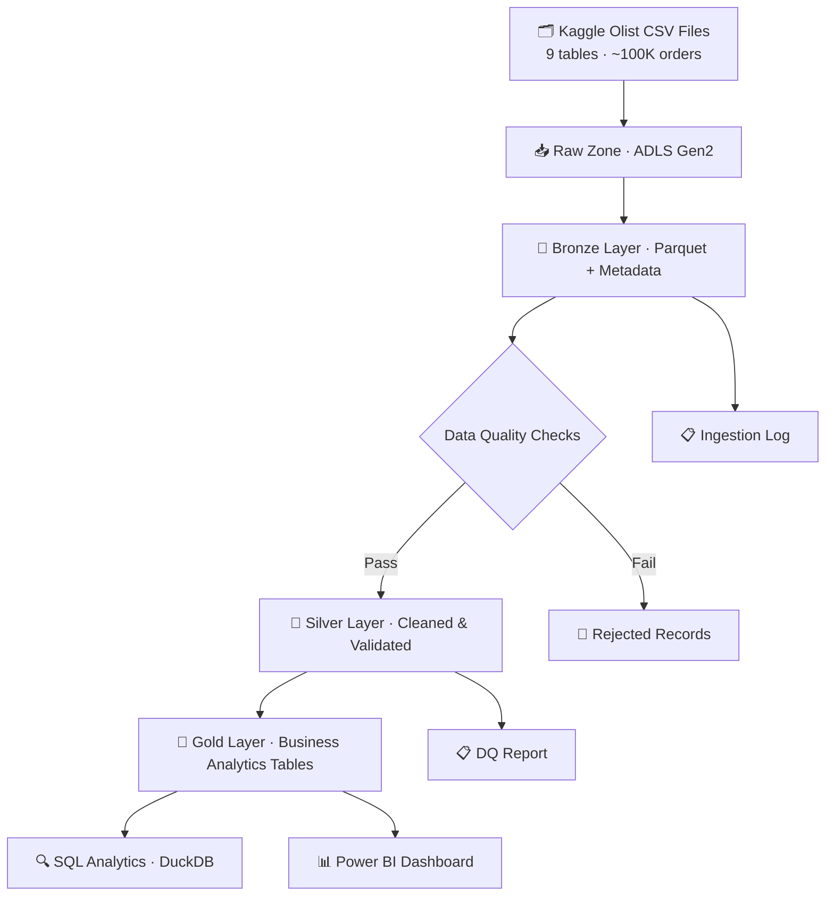

# Azure E-Commerce Lakehouse: End-to-End Data Engineering Platform

[](https://github.com/harishbhavandla/ecommerce-lakehouse/actions/workflows/ci.yml)


## Overview

An end-to-end cloud data engineering platform built on **Azure Data Lake Storage Gen2**,
implementing the **Medallion Architecture** (Bronze → Silver → Gold) to transform raw
Brazilian Olist e-commerce data into analytics-ready business intelligence.

This project demonstrates real-world data engineering practices including pipeline design,
data quality validation, Parquet storage, DuckDB SQL analytics, and Power BI dashboarding.

---

## Architecture



---

## Tech Stack

| Layer | Technology |
|---|---|
| Cloud Storage | Azure Data Lake Storage Gen2 |
| Orchestration | Azure Data Factory (design) / Python scripts |
| Processing | Python 3.10, Pandas |
| Storage Format | Apache Parquet |
| SQL Analytics | DuckDB / Azure Synapse Serverless |
| Dashboarding | Power BI Desktop |
| CI/CD | GitHub Actions |
| Version Control | Git / GitHub |

---

## Dataset

**Brazilian Olist E-Commerce Dataset** — 9 related tables, ~100K orders, real marketplace data.

Source: [Kaggle — Olist E-Commerce](https://www.kaggle.com/datasets/olistbr/brazilian-ecommerce)

| Table | Description | Rows |
|---|---|---|
| customers | Customer info and location | 99,441 |
| orders | Order status and timestamps | 99,441 |
| order_items | Items within each order | 112,650 |
| products | Product catalog | 32,951 |
| sellers | Seller info and location | 3,095 |
| payments | Payment details per order | 103,886 |
| reviews | Customer reviews | 99,224 |
| geolocation | ZIP-code lat/lon data | 1,000,163 |
| product_category_translation | Portuguese → English categories | 71 |

---

## Medallion Layers

| Layer | Description | Format | Location |
|---|---|---|---|
| Raw | Original CSV files, never modified | CSV | `data/raw/` |
| Bronze | Parquet + ingestion metadata | Parquet | `data/bronze/{table}/ingestion_date=` |
| Silver | Cleaned, typed, validated | Parquet | `data/silver/{table}/` |
| Gold | Business analytics marts for reporting | Parquet | `data/gold/{table}/` |

---

## Pipeline Status

| Stage | Script | Status | Output |
|---|---|---|---|
| Bronze | `src/ingestion/bronze_ingestion.py` | Complete | 9 Parquet tables with ingestion metadata |
| Silver | `src/transformation/silver_transformations.py` | Complete | 9 clean Parquet tables + rejected records |
| Gold | `src/transformation/gold_transformations.py` | Complete | 9 analytics Parquet tables |
| SQL | `sql/*.sql` | Complete | 7 DuckDB query files over Gold Parquet |

### Gold Analytics Tables

| Table | Business Purpose |
|---|---|
| `daily_sales` | Daily orders, customers, item volume, revenue, and AOV |
| `monthly_revenue` | Monthly revenue trend, customer count, delivered orders, and review score |
| `customer_lifetime_value` | Customer-level CLV, repeat purchase flag, order history, and reviews |
| `product_performance` | Product/category sales, item volume, revenue, and seller coverage |
| `seller_performance` | Seller revenue, orders, products, customers, and freight contribution |
| `delivery_delay_analysis` | Delivery delay buckets by customer state with review impact |
| `payment_behavior` | Payment type and installment behavior |
| `review_score_analysis` | Review scores by comment flag, payment value, and delivery performance |
| `regional_sales` | State/city-level sales, delivery, customers, and review metrics |

---

## Project Structure

```
ecommerce-lakehouse/
├── src/
│   ├── ingestion/          # Bronze layer pipeline
│   ├── transformation/     # Silver and Gold pipelines
│   └── utils/              # Logging and Azure utilities
├── sql/                    # Analytics SQL queries
├── tests/                  # Unit tests (pytest)
├── docs/                   # Architecture and data documentation
├── notebooks/              # Exploration notebooks
├── config/                 # Configuration files
├── logs/                   # Pipeline run logs (generated)
└── .github/workflows/      # CI/CD pipeline
```

---

## How to Run Locally

```bash
# 1. Clone the repository
git clone https://github.com/harishbhavandla/ecommerce-lakehouse.git
cd ecommerce-lakehouse

# 2. Create virtual environment
python -m venv venv
source venv/bin/activate  # Windows: venv\Scripts\activate

# 3. Install dependencies
pip install -r requirements.txt

# 4. Place Olist CSVs in data/raw/

# 5. Run Bronze ingestion
python src/ingestion/bronze_ingestion.py

# Optional: run Bronze ingestion against Azure ADLS Gen2
python src/ingestion/bronze_ingestion.py --environment azure

# 6. Run Silver transformation  (Session 4)
python src/transformation/silver_transformations.py

# Optional: run Silver transformation against Azure ADLS Gen2
python src/transformation/silver_transformations.py --environment azure

# 7. Run Gold transformation    (Session 5)
python src/transformation/gold_transformations.py

# 8. Run DuckDB analytics queries
duckdb < sql/01_revenue_trends.sql
```

---

## SQL Analytics

The `sql/` folder contains DuckDB queries that read Gold Parquet files directly:

| File | Focus |
|---|---|
| `01_revenue_trends.sql` | Daily/monthly revenue and AOV |
| `02_customer_lifetime_value.sql` | CLV and repeat customers |
| `03_seller_performance.sql` | Seller leaderboard and state rollups |
| `04_product_performance.sql` | Product and category performance |
| `05_review_analysis.sql` | Reviews, delivery delays, and customer satisfaction |
| `06_payment_behavior.sql` | Payment type and installment behavior |
| `07_regional_sales.sql` | State/city regional sales |

---

## Documentation

- [Architecture Overview](docs/architecture.md)
- [Pipeline Flow](docs/pipeline_flow.md)
- [Data Dictionary](docs/data_dictionary.md)
- [Data Quality Rules](docs/data_quality.md)
- [Azure Deployment Guide](docs/azure_deployment.md)

---

## Dashboard

Power BI can connect to the Gold Parquet outputs or DuckDB query results for six reporting
pages: Executive Overview, Revenue Trends, Customer Value, Product Performance, Seller
Performance, and Regional Delivery Insights.

---

## Author

**Harish Bhavandla** — Master's in Data Science for Management, Università Cattolica, Milan
[LinkedIn](https://linkedin.com/in/harishbhavandla) · [GitHub](https://github.com/harishbhavandla)
