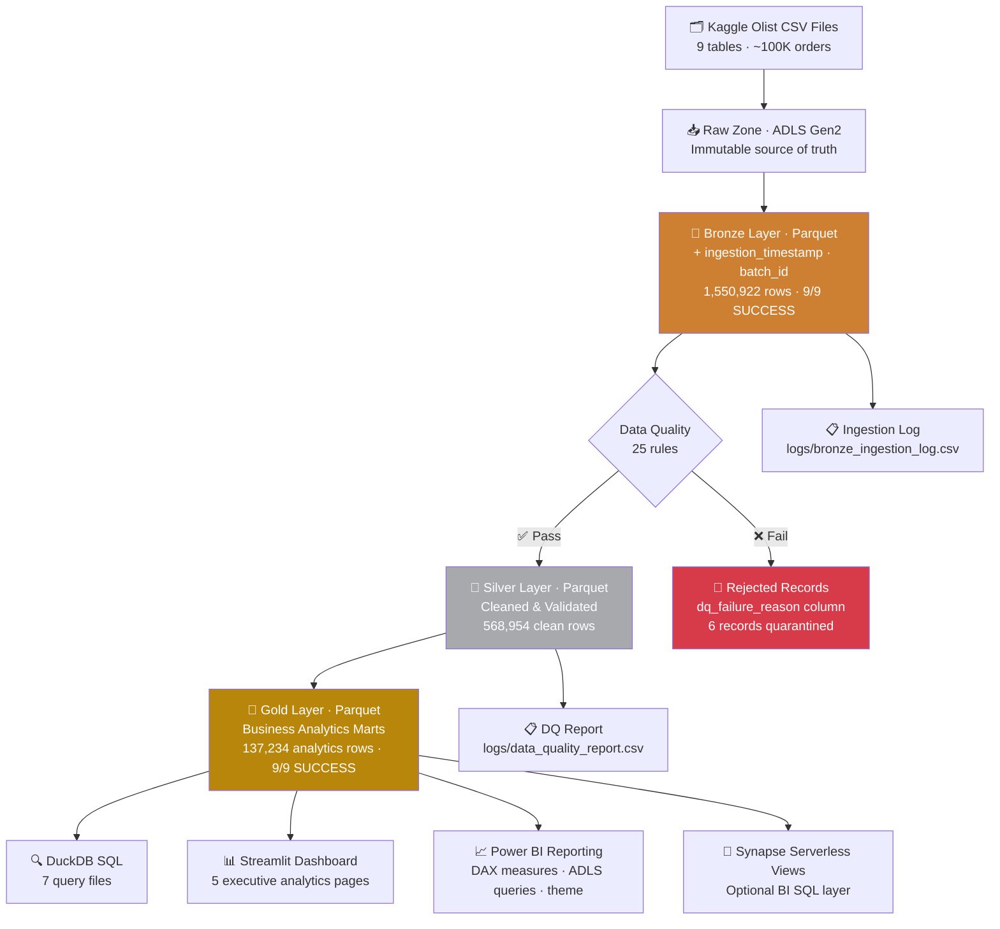

# Azure E-Commerce Lakehouse

[](https://github.com/harishbhavandla/ecommerce-lakehouse/actions/workflows/ci.yml)
[](https://github.com/harishbhavandla/ecommerce-lakehouse/actions/workflows/azure-medallion.yml)


End-to-end cloud data engineering platform on **Azure Data Lake Storage Gen2**, implementing the **Medallion Architecture** (Bronze → Silver → Gold) to transform raw Brazilian Olist e-commerce data into analytics-ready business intelligence.

**1,550,922 rows ingested · 25 data quality rules · 9 Gold analytics marts · Power BI reporting layer · Streamlit dashboard · 13 unit tests passing · CI/CD on GitHub Actions**

---

## Architecture



---

## Pipeline Results

| Layer  | Tables | Rows         | Status     |
|--------|--------|--------------|------------|
| Bronze | 9 / 9  | 1,550,922    | ✅ SUCCESS |
| Silver | 9 / 9  | 568,954 clean + 6 rejected | ✅ SUCCESS |
| Gold   | 9 / 9  | 137,234      | ✅ SUCCESS |

> Azure infrastructure: `stecomlakehousehb01` · container `olist-lakehouse` · region West Europe

---

## Tech Stack

| Domain           | Technology                              |
|------------------|-----------------------------------------|
| Cloud Storage    | Azure Data Lake Storage Gen2            |
| Authentication   | AzureCliCredential + OIDC (no secrets)  |
| Processing       | Python 3.10, Pandas                     |
| Storage Format   | Apache Parquet (PyArrow)                |
| SQL Analytics    | DuckDB / Azure Synapse Serverless       |
| Dashboarding     | Power BI Desktop, Power BI Service, Streamlit, Plotly |
| CI/CD            | GitHub Actions (2 workflows)            |
| Testing          | pytest — 13 unit tests, all passing     |
| Config           | YAML (config/config.yaml)               |
| Logging          | Loguru + CSV audit reports              |

---

## Dataset

**Brazilian Olist E-Commerce** — 9 related tables, real marketplace data, 2016–2018.  
Source: [Kaggle — Olist E-Commerce](https://www.kaggle.com/datasets/olistbr/brazilian-ecommerce)

| Table                        | Description                            | Rows      |
|------------------------------|----------------------------------------|-----------|
| customers                    | Customer ID, city, state, ZIP          | 99,441    |
| orders                       | Order status and timestamps            | 99,441    |
| order_items                  | Items: product, seller, price, freight | 112,650   |
| products                     | Product catalogue, dimensions          | 32,951    |
| sellers                      | Seller ID and location                 | 3,095     |
| payments                     | Payment type, installments, amount     | 103,886   |
| reviews                      | Customer review score + comment        | 99,224    |
| geolocation                  | ZIP-code latitude/longitude lookup     | 1,000,163 |
| product_category_translation | Portuguese → English category names   | 71        |

---

## Medallion Layers

### 🥉 Bronze — Raw to Parquet Ingestion

`src/ingestion/bronze_ingestion.py`

Reads CSVs from the Raw zone and writes Hive-partitioned Parquet to Bronze. No data is modified — Bronze adds only audit metadata.

**Metadata columns added:** `ingestion_timestamp` · `source_file_name` · `batch_id` · `ingestion_date`  
**Partitioning:** `bronze/{table}/ingestion_date=YYYY-MM-DD/` — enables date-based partition pruning in Synapse

### 🥈 Silver — Data Quality & Cleaning

`src/transformation/silver_transformations.py`

Applies 25 data quality rules across all 7 business tables. Records failing any rule are **quarantined** to `data/rejected/` with a `dq_failure_reason` column — nothing is silently dropped.

**Transformations:** type casting · null checks · deduplication · state code validation · referential integrity · date logic · range checks

<details>
<summary>View all 25 DQ rules</summary>

| Rule ID      | Table        | Column                        | Check                                  |
|--------------|--------------|-------------------------------|----------------------------------------|
| DQ-CUST-001  | customers    | customer_id                   | Must not be null                       |
| DQ-CUST-002  | customers    | customer_unique_id            | Must not be null                       |
| DQ-CUST-003  | customers    | customer_state                | Valid 2-letter Brazilian state code    |
| DQ-ORD-001   | orders       | order_id                      | Must not be null                       |
| DQ-ORD-002   | orders       | customer_id                   | Must not be null                       |
| DQ-ORD-003   | orders       | order_status                  | Known status value                     |
| DQ-ORD-004   | orders       | order_purchase_timestamp      | Must not be null                       |
| DQ-ORD-005   | orders       | order_delivered_customer_date | If present: must be ≥ purchase date    |
| DQ-ORD-006   | orders       | customer_id                   | Must exist in customers (RI)           |
| DQ-ITM-001   | order_items  | order_id                      | Must not be null                       |
| DQ-ITM-004   | order_items  | price                         | Must be ≥ 0                            |
| DQ-ITM-005   | order_items  | freight_value                 | Must be ≥ 0                            |
| DQ-ITM-006   | order_items  | order_id                      | Must exist in orders (RI)              |
| DQ-PAY-001   | payments     | order_id                      | Must not be null                       |
| DQ-PAY-002   | payments     | payment_value                 | Must be ≥ 0                            |
| DQ-PAY-003   | payments     | payment_installments          | Must be ≥ 1                            |
| DQ-PAY-004   | payments     | payment_type                  | credit_card / boleto / voucher / debit_card |
| DQ-REV-001   | reviews      | review_id                     | Must not be null                       |
| DQ-REV-002   | reviews      | order_id                      | Must not be null                       |
| DQ-REV-003   | reviews      | review_score                  | Between 1 and 5 inclusive              |
| DQ-PRD-001   | products     | product_id                    | Must not be null                       |
| DQ-PRD-002   | products     | product_weight_g              | If present: must be > 0                |
| DQ-SEL-001   | sellers      | seller_id                     | Must not be null                       |
| DQ-GEO-001   | geolocation  | geolocation_zip_code_prefix   | Must not be null                       |
| DQ-CAT-001   | categories   | product_category_name         | Must not be null                       |

</details>

### 🥇 Gold — Business Analytics Marts

`src/transformation/gold_transformations.py`

Pre-aggregated, business-ready Parquet files for direct Power BI and DuckDB consumption.

| Gold Table                 | Business Question Answered                              |
|----------------------------|---------------------------------------------------------|
| `daily_sales`              | Orders, revenue, and AOV per day                        |
| `monthly_revenue`          | Month-over-month revenue trends and review scores       |
| `customer_lifetime_value`  | CLV, repeat purchase flag, order history                |
| `product_performance`      | Product and category revenue ranking                    |
| `seller_performance`       | Seller leaderboard with freight contribution            |
| `delivery_delay_analysis`  | Delay buckets by state with review score impact         |
| `payment_behavior`         | Payment type split and installment behaviour            |
| `review_score_analysis`    | Review scores by delivery, payment, and comment flag    |
| `regional_sales`           | State/city sales, delivery, and customer metrics        |

---

## SQL Analytics

Seven DuckDB query files in `sql/` run directly against Gold Parquet — no database server required:

```bash
duckdb < sql/01_revenue_trends.sql
```

| File                            | Focus                              |
|---------------------------------|------------------------------------|
| `01_revenue_trends.sql`         | Daily/monthly revenue and AOV      |
| `02_customer_lifetime_value.sql`| CLV and repeat customer analysis   |
| `03_seller_performance.sql`     | Seller leaderboard and state rollups |
| `04_product_performance.sql`    | Product and category performance   |
| `05_review_analysis.sql`        | Reviews, delays, and satisfaction  |
| `06_payment_behavior.sql`       | Payment type and installments      |
| `07_regional_sales.sql`         | State/city regional breakdown      |

The same analytical layer can also be exposed through **Azure Synapse Serverless SQL** using `sql/08_synapse_serverless_gold_views.sql`.

---

## Executive Dashboard

`dashboard/app.py` provides a Streamlit dashboard that reads the Gold Parquet marts directly from `data/gold/`.

It includes five analytics views:

| Page                 | Focus                                                    |
|----------------------|----------------------------------------------------------|
| Revenue              | Daily revenue, monthly revenue, AOV, order volume        |
| Customers            | CLV leaderboard, repeat customers, state concentration    |
| Products and Sellers | Category revenue, seller performance, freight metrics    |
| Operations           | Delivery delays, payment behavior, review distribution   |
| Regions              | City/state sales, delivery quality, customer reach        |

```bash
streamlit run dashboard/app.py
```

---

## Power BI Reporting

The `powerbi/` folder contains a complete Power BI-ready reporting package over the Gold marts:

| File | Purpose |
|------|---------|
| `powerbi/power_query_adls_gen2.m` | Power Query M queries for ADLS Gen2 Gold Parquet |
| `powerbi/power_query_local_gold.m` | Local fallback queries for `data/gold/` |
| `powerbi/measures.dax` | Business DAX measures for the semantic model |
| `powerbi/report_blueprint.md` | Six-page report design and visual specifications |
| `powerbi/theme.json` | Branded Azure-style Power BI theme |
| `sql/08_synapse_serverless_gold_views.sql` | Optional Synapse Serverless views over Gold Parquet |

Recommended reporting path:

```text
ADLS Gen2 Gold Parquet -> Power BI Semantic Model -> Power BI Report -> Power BI Service
```

Alternative enterprise path:

```text
ADLS Gen2 Gold Parquet -> Synapse Serverless SQL Views -> Power BI
```

Power BI Desktop is a Windows application, so the final `.pbix` is assembled in Power BI Desktop using the assets in `powerbi/`.

---

## CI/CD

Two GitHub Actions workflows:

**`ci.yml`** — triggered on every push and PR:
- Lint with `flake8`
- Format check with `black`
- Run 13 pytest unit tests

**`azure-medallion.yml`** — manual trigger (workflow_dispatch):
- OIDC login to Azure (no stored secrets)
- Bronze → Silver → Gold pipeline against live ADLS Gen2

Authentication uses **federated OIDC identity** via an App Registration with the `Storage Blob Data Contributor` RBAC role — zero hardcoded credentials anywhere in the codebase.

---

## Project Structure

```
ecommerce-lakehouse/
├── src/
│   ├── ingestion/              # bronze_ingestion.py
│   ├── transformation/         # silver_transformations.py, gold_transformations.py
│   └── utils/                  # logger.py
├── dashboard/                  # Streamlit executive dashboard
├── powerbi/                    # Power BI queries, DAX, theme, report blueprint
├── sql/                        # 7 DuckDB analytics queries
├── tests/                      # 13 pytest unit tests
├── docs/                       # Architecture, data dictionary, DQ rules, Azure guide
├── config/
│   └── config.yaml             # All paths, table names, Azure config
├── data/
│   ├── raw/                    # Source CSVs (not committed)
│   ├── bronze/                 # Parquet + metadata (generated)
│   ├── silver/                 # Cleaned Parquet (generated)
│   ├── gold/                   # Analytics marts (generated)
│   └── rejected/               # DQ-failed records (generated)
├── logs/                       # Ingestion log + DQ report (generated)
└── .github/workflows/          # ci.yml, azure-medallion.yml
```

---

## How to Run

### Local

```bash
# Clone and set up
git clone https://github.com/harishbhavandla/ecommerce-lakehouse.git
cd ecommerce-lakehouse
python -m venv venv && source venv/bin/activate
pip install -r requirements.txt

# Place Olist CSVs in data/raw/

# Run the full pipeline
python src/ingestion/bronze_ingestion.py
python src/transformation/silver_transformations.py
python src/transformation/gold_transformations.py

# Run SQL analytics
duckdb < sql/01_revenue_trends.sql

# Launch dashboard
streamlit run dashboard/app.py

# Run tests
pytest tests/ -v
```

### Azure ADLS Gen2

```bash
# Authenticate
az login

# Run each layer against Azure
python src/ingestion/bronze_ingestion.py             --environment azure
python src/transformation/silver_transformations.py  --environment azure
python src/transformation/gold_transformations.py    --environment azure
```

> Requires Storage Blob Data Contributor role on `stecomlakehousehb01`. See [Azure Deployment Guide](docs/azure_deployment.md).

---

## Documentation

| Doc | Description |
|-----|-------------|
| [Architecture Overview](docs/architecture.md) | Layer design, Azure infra, data flow |
| [Pipeline Flow](docs/pipeline_flow.md) | Step-by-step pipeline walkthrough |
| [Data Dictionary](docs/data_dictionary.md) | All columns, types, and descriptions |
| [Data Quality Rules](docs/data_quality.md) | All 25 DQ rules and rejection schema |
| [Azure Deployment Guide](docs/azure_deployment.md) | ADLS setup, RBAC, OIDC, GitHub Secrets |

---

## Power BI Report Pages

Six reporting pages connect directly to Gold Parquet or Synapse Serverless views:

1. **Executive Overview** — KPI tiles, daily revenue trend, monthly revenue, regional summary
2. **Revenue Trends** — Revenue movement, order volume, AOV, customer activity
3. **Customer Lifetime Value** — CLV distribution, repeat customers, top customer table
4. **Product and Seller Performance** — Category share, seller leaderboard, freight contribution
5. **Delivery and Customer Experience** — Delay buckets, review score impact, late delivery rate
6. **Payment and Regional Sales** — Payment mix, installment behavior, city/state sales

---

## Author

**Harish Bhavandla**  
Master's in Data Science for Management · Università Cattolica del Sacro Cuore, Milan  
[LinkedIn](https://www.linkedin.com/in/harish-bhavandla/) · [GitHub](https://github.com/harish885) · bhavandlaharish@gmail.com
