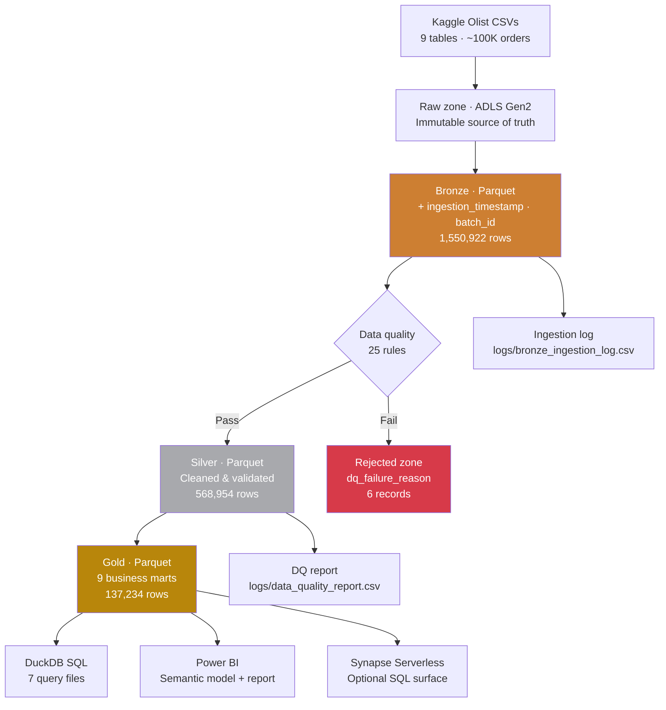

# Azure E-Commerce Lakehouse

[](https://github.com/harish885/ecommerce-lakehouse/actions/workflows/ci.yml)
[](https://github.com/harish885/ecommerce-lakehouse/actions/workflows/azure-medallion.yml)


End-to-end cloud data engineering platform on **Azure Data Lake Storage Gen2**,
implementing the **Medallion Architecture** (Bronze → Silver → Gold) to turn
raw Brazilian Olist e-commerce data into a Power BI semantic model.

**1.55M rows ingested · 25 data quality rules · 9 Gold analytics marts ·
Power BI semantic model · 13 unit tests · CI/CD on GitHub Actions**

---

## Architecture



The Bronze, Silver, and Gold pipelines are environment-agnostic — they run
against the local filesystem (for development) or against ADLS Gen2 (in
GitHub Actions) through a single `Storage` abstraction in
[`src/utils/storage.py`](src/utils/storage.py). One code path, two backends.

---

## Pipeline results

| Layer  | Tables | Rows                      | Status |
|--------|-------:|---------------------------|--------|
| Bronze |  9 / 9 | 1,550,922                 | ✅     |
| Silver |  9 / 9 | 568,954 clean + 6 rejected | ✅     |
| Gold   |  9 / 9 | 137,234                   | ✅     |

> Azure target: storage `stecomlakehousehb01` · file system `olist-lakehouse` · region `westeurope`.

---

## Tech stack

| Domain          | Technology                                  |
|-----------------|---------------------------------------------|
| Cloud storage   | Azure Data Lake Storage Gen2                |
| Authentication  | `AzureCliCredential` locally · OIDC in CI   |
| Processing      | Python 3.10 · pandas · pyarrow              |
| Storage format  | Apache Parquet (Hive-partitioned in Bronze) |
| SQL analytics   | DuckDB · optional Azure Synapse Serverless  |
| BI              | Power BI Desktop · Power BI Service         |
| CI/CD           | GitHub Actions (2 workflows)                |
| Testing         | pytest — 13 unit tests                      |
| Config          | YAML (`config/config.yaml`)                 |
| Logging         | loguru + CSV run audit                      |

---

## Dataset

**Brazilian Olist E-Commerce** — 9 related tables of real marketplace data
spanning 2016–2018. Source: [Kaggle — Olist E-Commerce](https://www.kaggle.com/datasets/olistbr/brazilian-ecommerce).

| Table                          | Description                            | Rows      |
|--------------------------------|----------------------------------------|----------:|
| customers                      | Customer ID, city, state, ZIP          |    99,441 |
| orders                         | Order status and timestamps            |    99,441 |
| order_items                    | Items: product, seller, price, freight |   112,650 |
| products                       | Product catalogue, dimensions          |    32,951 |
| sellers                        | Seller ID and location                 |     3,095 |
| payments                       | Payment type, installments, amount     |   103,886 |
| reviews                        | Customer review score + comment        |    99,224 |
| geolocation                    | ZIP-code latitude/longitude lookup     | 1,000,163 |
| product_category_translation   | Portuguese → English categories        |        71 |

---

## Medallion layers

### Bronze — raw to Parquet ingestion

`src/ingestion/bronze_ingestion.py`

Reads CSVs from the Raw zone and writes Hive-partitioned Parquet to Bronze.
No data is modified — Bronze adds only audit metadata.

| Added column          | Purpose                              |
|-----------------------|--------------------------------------|
| `ingestion_timestamp` | Exact datetime ingested              |
| `source_file_name`    | Original CSV filename                |
| `batch_id`            | Unique batch run identifier          |
| `ingestion_date`      | Hive partition value (YYYY-MM-DD)    |

Output: `bronze/olist/{table}/ingestion_date=YYYY-MM-DD/{table}_{batch_id}.parquet`

### Silver — data quality and cleaning

`src/transformation/silver_transformations.py`

Applies 25 data quality rules across the 7 business tables. Records that fail
any rule are quarantined to the Rejected zone with a `dq_failure_reason`
column — nothing is silently dropped.

Transformations: type casting, null checks, deduplication, state code
validation, referential integrity, date logic, range checks.

<details>
<summary>All 25 DQ rules</summary>

| Rule ID      | Table        | Column                        | Check                                       |
|--------------|--------------|-------------------------------|---------------------------------------------|
| DQ-CUST-001  | customers    | customer_id                   | Not null                                    |
| DQ-CUST-002  | customers    | customer_unique_id            | Not null                                    |
| DQ-CUST-003  | customers    | customer_state                | Valid 2-letter Brazilian state code         |
| DQ-ORD-001   | orders       | order_id                      | Not null                                    |
| DQ-ORD-002   | orders       | customer_id                   | Not null                                    |
| DQ-ORD-003   | orders       | order_status                  | Known status value                          |
| DQ-ORD-004   | orders       | order_purchase_timestamp      | Not null                                    |
| DQ-ORD-005   | orders       | order_delivered_customer_date | If present: ≥ purchase date                 |
| DQ-ORD-006   | orders       | customer_id                   | Must exist in customers (RI)                |
| DQ-ITM-001   | order_items  | order_id                      | Not null                                    |
| DQ-ITM-004   | order_items  | price                         | ≥ 0                                         |
| DQ-ITM-005   | order_items  | freight_value                 | ≥ 0                                         |
| DQ-ITM-006   | order_items  | order_id                      | Must exist in orders (RI)                   |
| DQ-PAY-001   | payments     | order_id                      | Not null                                    |
| DQ-PAY-002   | payments     | payment_value                 | ≥ 0                                         |
| DQ-PAY-003   | payments     | payment_installments          | ≥ 1                                         |
| DQ-PAY-004   | payments     | payment_type                  | credit_card / boleto / voucher / debit_card |
| DQ-REV-001   | reviews      | review_id                     | Not null                                    |
| DQ-REV-002   | reviews      | order_id                      | Not null                                    |
| DQ-REV-003   | reviews      | review_score                  | Between 1 and 5 inclusive                   |
| DQ-PRD-001   | products     | product_id                    | Not null                                    |
| DQ-PRD-002   | products     | product_weight_g              | If present: > 0                             |
| DQ-SEL-001   | sellers      | seller_id                     | Not null                                    |
| DQ-GEO-001   | geolocation  | geolocation_zip_code_prefix   | Deduplicated to one point per ZIP           |
| DQ-CAT-001   | categories   | product_category_name         | Not null                                    |

</details>

### Gold — business analytics marts

`src/transformation/gold_transformations.py`

Pre-aggregated, business-ready Parquet tables built directly for Power BI
consumption.

| Gold mart                  | Business question                                  |
|----------------------------|----------------------------------------------------|
| `daily_sales`              | Orders, revenue, AOV per day                       |
| `monthly_revenue`          | Month-over-month revenue and review trends         |
| `customer_lifetime_value`  | CLV, repeat purchase flag, order history           |
| `product_performance`      | Product / category revenue ranking                 |
| `seller_performance`       | Seller leaderboard and freight contribution        |
| `delivery_delay_analysis`  | Delay buckets by state and review impact           |
| `payment_behavior`         | Payment type mix and installment behaviour         |
| `review_score_analysis`    | Review scores by delivery, payment, comment flag   |
| `regional_sales`           | State / city sales, delivery, customer reach       |

---

## SQL analytics

Seven DuckDB query files in `sql/` run directly against Gold Parquet — no
database server required:

```bash
duckdb < sql/01_revenue_trends.sql
```

| File                              | Focus                                |
|-----------------------------------|--------------------------------------|
| `01_revenue_trends.sql`           | Daily / monthly revenue and AOV      |
| `02_customer_lifetime_value.sql`  | CLV and repeat customer analysis     |
| `03_seller_performance.sql`       | Seller leaderboard and state rollups |
| `04_product_performance.sql`      | Product and category performance     |
| `05_review_analysis.sql`          | Reviews, delays, satisfaction        |
| `06_payment_behavior.sql`         | Payment type and installments        |
| `07_regional_sales.sql`           | State / city regional breakdown      |

The same analytical layer can be exposed through **Azure Synapse Serverless
SQL** using `sql/08_synapse_serverless_gold_views.sql`.

---

## Power BI reporting

The `powerbi/` folder holds the complete authoring kit for the report:

| File                                | Purpose                                                      |
|-------------------------------------|--------------------------------------------------------------|
| `powerbi/power_query_adls_gen2.m`   | Power Query M — load Gold Parquet from ADLS Gen2             |
| `powerbi/power_query_local_gold.m`  | Power Query M — local fallback for offline development       |
| `powerbi/measures.dax`              | DAX measures for the semantic model                          |
| `powerbi/report_blueprint.md`       | Six-page report design and visual specifications             |
| `powerbi/theme.json`                | Branded report theme (colours, typography)                   |
| `sql/08_synapse_serverless_gold_views.sql` | Optional Synapse Serverless views over Gold Parquet   |

Recommended path:

```text
ADLS Gen2 Gold Parquet  →  Power BI semantic model  →  Power BI report  →  Power BI Service
```

Enterprise alternative when a SQL surface is preferred:

```text
ADLS Gen2 Gold Parquet  →  Synapse Serverless SQL views  →  Power BI
```

Power BI Desktop is Windows-only, so the final `.pbix` is assembled in
Power BI Desktop on Windows from the assets above. See
[`powerbi/README.md`](powerbi/README.md) for the build steps.

### Report pages

1. **Executive Overview** — KPI tiles, daily revenue trend, monthly revenue, regional summary.
2. **Revenue Trends** — Revenue movement, order volume, AOV, customer activity.
3. **Customer Lifetime Value** — CLV distribution, repeat customers, top-customer table.
4. **Product and Seller Performance** — Category share, seller leaderboard, freight contribution.
5. **Delivery and Customer Experience** — Delay buckets, review-score impact, late delivery rate.
6. **Payment and Regional Sales** — Payment mix, installment behaviour, city / state sales.

---

## CI/CD

Two GitHub Actions workflows.

**`ci.yml`** — every push and PR:
- `flake8` lint
- `black --check` formatting
- 13 pytest unit tests

**`azure-medallion.yml`** — manual trigger (`workflow_dispatch`):
- OIDC login to Azure (no stored secrets)
- Bronze → Silver → Gold against live ADLS Gen2
- Verifies 9 Gold Parquet files exist after the run

Authentication uses **federated OIDC identity** via an App Registration
holding the `Storage Blob Data Contributor` RBAC role — zero hardcoded
credentials anywhere in the codebase.

---

## Project structure

```
ecommerce-lakehouse/
├── src/
│   ├── ingestion/              # bronze_ingestion.py
│   ├── transformation/         # silver_transformations.py, gold_transformations.py
│   └── utils/                  # storage.py, config.py, logger.py
├── powerbi/                    # M queries, DAX, theme, report blueprint
├── sql/                        # 7 DuckDB analytics queries + 1 Synapse views
├── tests/                      # pytest unit tests
├── docs/                       # Architecture, data dictionary, DQ rules, Azure guide
├── config/
│   └── config.yaml             # All paths, table names, Azure config
├── scripts/
│   └── upload_raw_to_adls.py   # One-shot bootstrap to push raw CSVs to ADLS
├── data/
│   ├── raw/                    # Source CSVs (gitignored)
│   ├── bronze/                 # Hive-partitioned Parquet (generated)
│   ├── silver/                 # Cleaned Parquet (generated)
│   ├── gold/                   # Analytics marts (generated)
│   └── rejected/               # DQ-failed records (generated)
├── logs/                       # Ingestion log + DQ report (generated)
└── .github/workflows/          # ci.yml, azure-medallion.yml
```

---

## How to run

### Local

```bash
git clone https://github.com/harishbhavandla/ecommerce-lakehouse.git
cd ecommerce-lakehouse

python -m venv venv && source venv/bin/activate
pip install -r requirements.txt

# Place the Olist CSVs in data/raw/

python -m src.ingestion.bronze_ingestion
python -m src.transformation.silver_transformations
python -m src.transformation.gold_transformations

duckdb < sql/01_revenue_trends.sql
pytest tests/ -v
```

### Azure ADLS Gen2

```bash
az login

# One-shot raw upload (only needed the first time)
python scripts/upload_raw_to_adls.py

python -m src.ingestion.bronze_ingestion             --environment azure
python -m src.transformation.silver_transformations  --environment azure
python -m src.transformation.gold_transformations    --environment azure
```

> Requires `Storage Blob Data Contributor` on `stecomlakehousehb01`.
> Full instructions in [Azure Deployment Guide](docs/azure_deployment.md).

---

## Documentation

| Doc | Description |
|-----|-------------|
| [Architecture overview](docs/architecture.md) | Layer design, Azure infrastructure, data flow |
| [Pipeline flow](docs/pipeline_flow.md) | Step-by-step pipeline walkthrough |
| [Data dictionary](docs/data_dictionary.md) | All columns, types, descriptions |
| [Data quality rules](docs/data_quality.md) | All 25 DQ rules and rejection schema |
| [Azure deployment guide](docs/azure_deployment.md) | ADLS setup, RBAC, OIDC, GitHub Secrets |

---

## Author

**Harish Bhavandla**
Master's in Data Science for Management · Università Cattolica del Sacro Cuore, Milan
[LinkedIn](https://www.linkedin.com/in/harish-bhavandla/) · [GitHub](https://github.com/harish885) · bhavandlaharish@gmail.com
