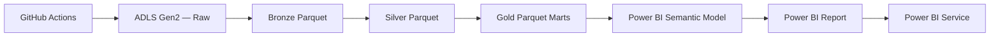

# Power BI Reporting Layer

This folder contains the Power BI authoring assets for the Azure E-Commerce
Lakehouse. Power BI Desktop is a Windows-only application, so the final
`.pbix` is assembled on Windows from the artefacts in this folder.

## Files

| File | Purpose |
|------|---------|
| `power_query_adls_gen2.m`   | Power Query M — load Gold Parquet straight from ADLS Gen2. Recommended path for the production report. |
| `power_query_local_gold.m`  | Power Query M — load Gold Parquet from a local clone (offline fallback for report development). |
| `measures.dax`              | DAX measures for the semantic model. |
| `report_blueprint.md`       | Page-by-page report design and visual specifications. |
| `theme.json`                | Branded report theme (colours, typography). |
| `../sql/08_synapse_serverless_gold_views.sql` | Optional Synapse Serverless SQL views over Gold Parquet. |

## Architecture



## Build the report

1. Open Power BI Desktop on Windows.
2. **Get data → Blank query**.
3. Open **Advanced Editor** and paste the `fnLoadGoldTable` function from
   `power_query_adls_gen2.m`. Name the query `fnLoadGoldTable`.
4. Create one Blank query per Gold mart (Daily Sales, Monthly Revenue, …).
   Each query is a single line that calls `fnLoadGoldTable("<mart>")` —
   so the storage account is configured in *one* place.
5. Load all queries to the model.
6. In the model view create a measure table named **Measures** and add every
   measure from `measures.dax`.
7. Apply the theme (`View → Browse for themes → theme.json`).
8. Build the six report pages as specified in `report_blueprint.md`.
9. Publish to Power BI Service and configure scheduled refresh.

## Azure connection

Default ADLS coordinates (also encoded in `power_query_adls_gen2.m`):

```text
Storage account : stecomlakehousehb01
File system     : olist-lakehouse
Gold prefix     : gold/olist
```

The signed-in identity needs at least `Storage Blob Data Reader` on the
storage account. For scheduled refresh in Power BI Service, configure the
dataset credentials with an account that holds the same role.

## Alternative: Synapse Serverless SQL

If you prefer a SQL surface over the lake (cleaner for report developers
who don't want to think about Parquet folders), expose the Gold marts as
Synapse Serverless views:

1. Run `sql/08_synapse_serverless_gold_views.sql` in Synapse Studio.
2. In Power BI Desktop, connect via **Azure Synapse Analytics SQL**.
3. Import the views from database `ecommerce_lakehouse`.

The Gold Parquet remains the source of truth — Synapse just gives you a
T-SQL surface over it.

## Refresh schedule

Recommended cadence in Power BI Service:

```text
GitHub Actions Azure Medallion Pipeline runs  →  Gold Parquet rewrites
                                                      ↓
                                   Power BI dataset scheduled refresh
                                                      ↓
                                   Report tiles update in the workspace
```

Set the dataset refresh to fire ~10 minutes after the Medallion workflow
typically completes; an hourly cap in Power BI Pro is plenty for this
dataset size.
