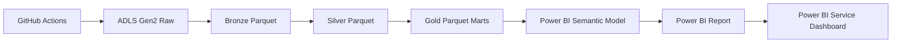

# Power BI Reporting Layer

This folder contains the Power BI-ready reporting assets for the Azure E-Commerce Lakehouse.

Power BI Desktop itself is a Windows application, so the final `.pbix` must be assembled in Power BI Desktop on Windows. Everything needed to build it is defined here: Azure Data Lake connection queries, local fallback queries, DAX measures, visual blueprint, and report theme.

## Recommended Architecture



## Files

| File | Purpose |
|------|---------|
| `power_query_adls_gen2.m` | Power Query M queries that load Gold Parquet files from Azure Data Lake Storage Gen2 |
| `power_query_local_gold.m` | Local fallback queries that load Gold Parquet files from `data/gold/` |
| `measures.dax` | DAX measures for the semantic model |
| `report_blueprint.md` | Page-by-page report design and visual specifications |
| `theme.json` | Power BI theme for consistent colors and typography |
| `../sql/08_synapse_serverless_gold_views.sql` | Optional Synapse Serverless SQL views over Gold Parquet |

## Build Steps

1. Open Power BI Desktop on Windows.
2. Select **Get data** -> **Blank query**.
3. Open **Advanced Editor**.
4. Copy one query from `power_query_adls_gen2.m`, paste it, and name the query exactly as shown.
5. Repeat for all nine Gold tables.
6. Load the tables into the model.
7. Add the measures from `measures.dax`.
8. Import `theme.json` from **View** -> **Browse for themes**.
9. Build the six report pages using `report_blueprint.md`.
10. Publish to Power BI Service.

## Azure Connection

The ADLS queries point to:

```text
Storage account: stecomlakehousehb01
File system:     olist-lakehouse
Gold prefix:     gold/olist
```

The signed-in Power BI user needs permission to read the storage account, typically:

```text
Storage Blob Data Reader
```

For production-style reporting, use a Power BI workspace, configure the dataset credentials, and schedule refresh after the GitHub Actions Azure Medallion Pipeline completes.

## Alternative: Synapse Serverless

If Power BI has trouble reading Parquet directly from ADLS, use Synapse Serverless SQL:

1. Run `sql/08_synapse_serverless_gold_views.sql` in Synapse Studio.
2. In Power BI Desktop, connect to **Azure Synapse Analytics SQL**.
3. Import the views from database `ecommerce_lakehouse`.

This creates a cleaner BI access layer while keeping Gold Parquet as the source of truth.
